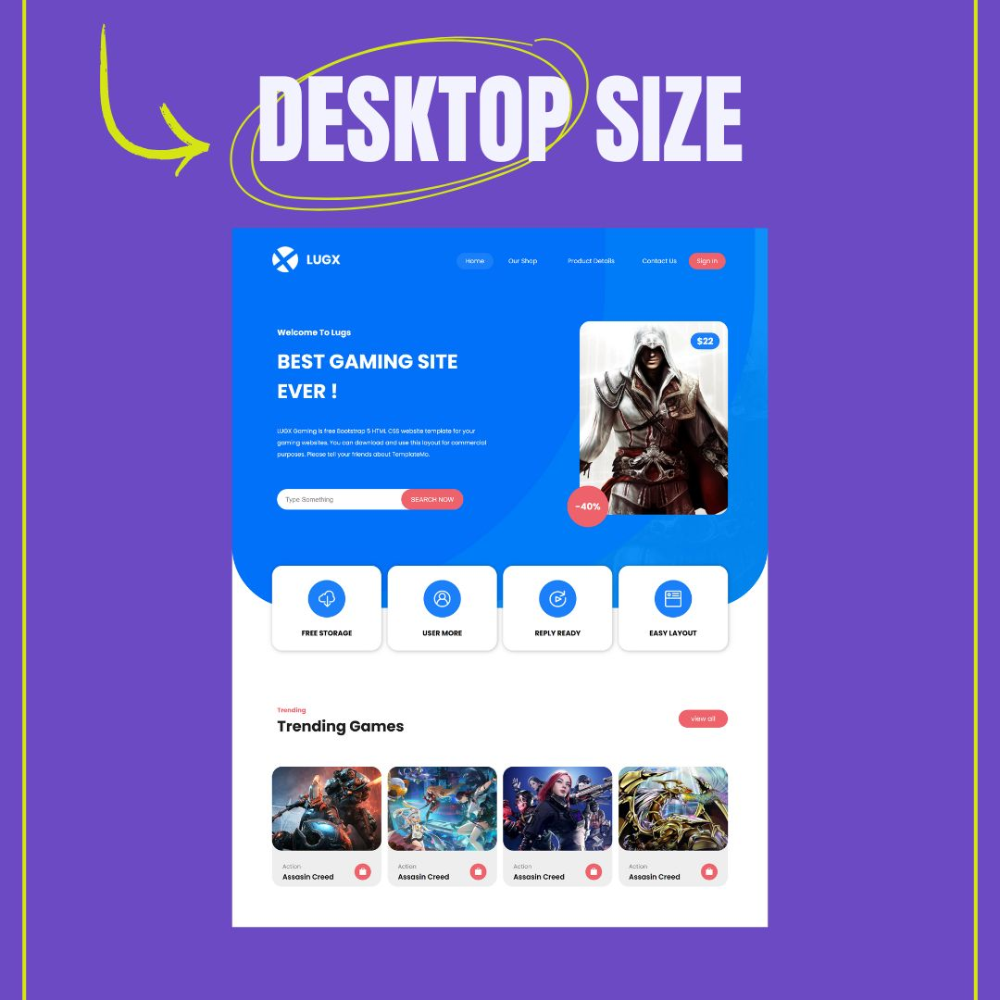
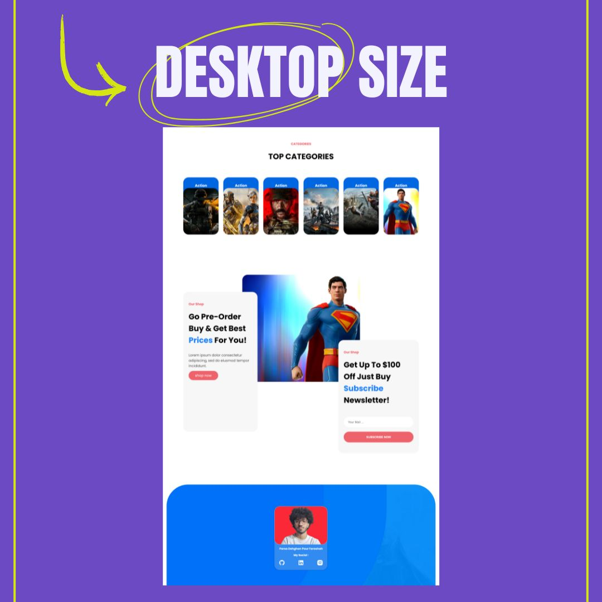
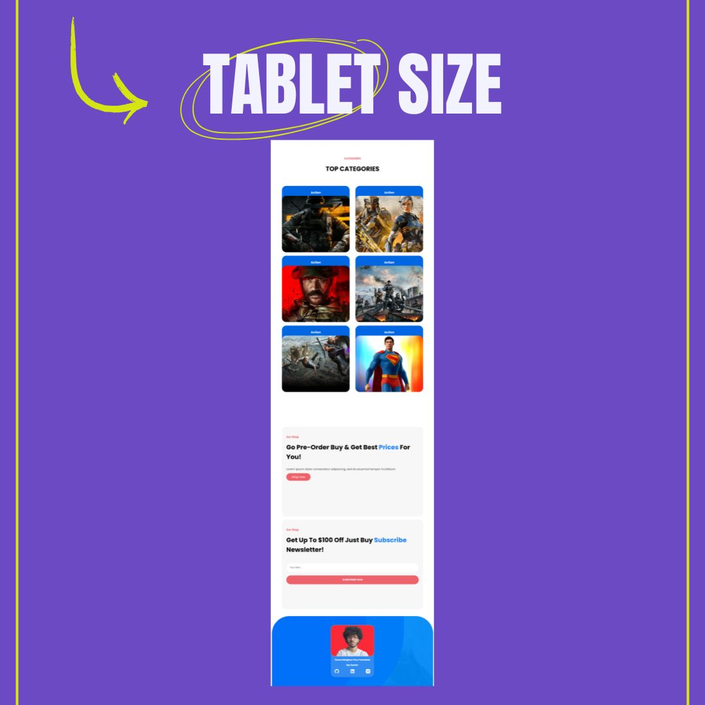
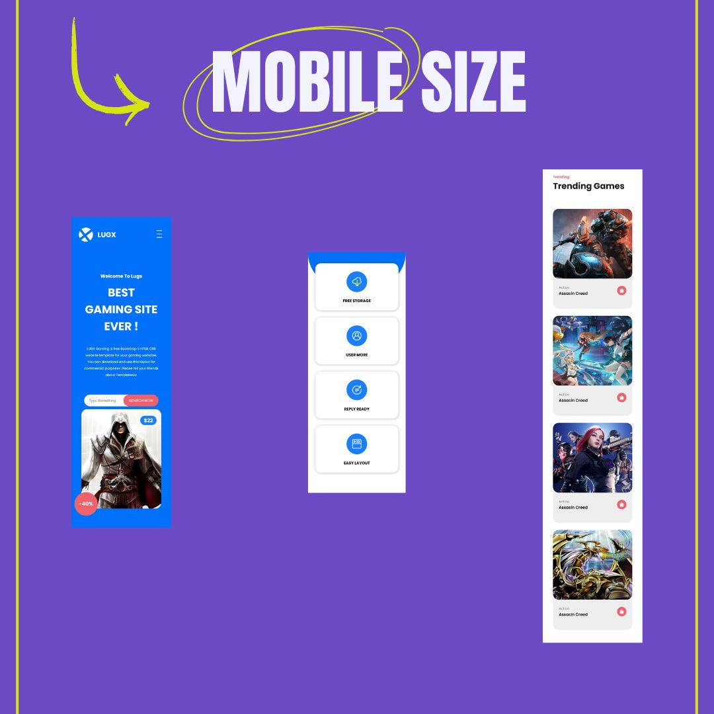
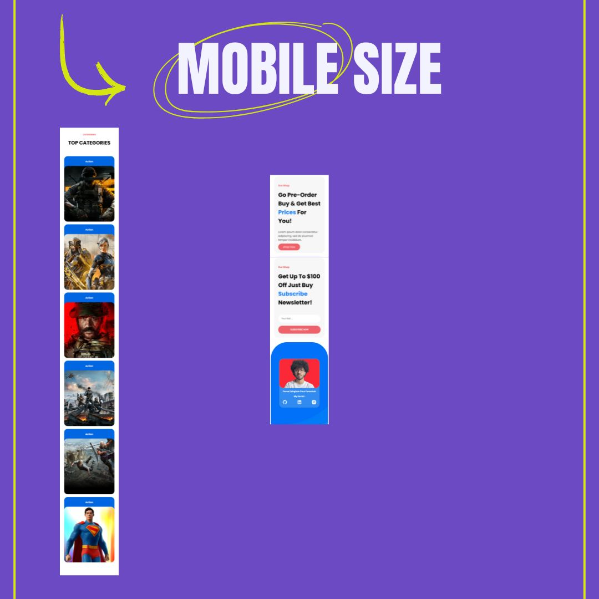

# 🎮 LugsWebGame – Responsive Gaming Website with HTML & CSS

A modern and fully responsive **gaming website UI** built using only **HTML and CSS**.  
It features a clean homepage, trending games section, and categorized game listings — all designed with pure frontend code and no JavaScript.

---

## 🌟 Features

- 🕹️ Trending Games Section  
- 🧩 Game Categories  
- 📱 Fully Responsive with Media Queries  
- 💻 Built with semantic HTML and modern CSS layout (Flex & Grid)  
- ⚡ Fast, lightweight and framework-free

---

## 📅 Created On  
**July 18, 2025**

## 👨‍💻 Developed By  
**Parsa Dehghan Pour Farashah**

## 🔧 Project Mentor  
[@parsa_ghorbanian_web](https://www.instagram.com/parsa_ghorbanian_web)

---

## 🛠️ Tech Stack  
- HTML5  
- CSS3  
- Media Queries (Responsive Design)

---

## 🔗 Live Demo  
[👉 Click Here to Explore the Website](https://parsa-farshah.github.io/LugsWebGame/)

---

## 📬 Contact Me

- 📸 Instagram: [@parsa_dehghanpour_dv](https://www.instagram.com/parsa_dehghanpour_dv)  
- 💼 LinkedIn: [Parsa Dehghan Pour Farashah](https://linkedin.com/in/parsa-dehghan-pour-farashah-85ab04250)  
- 💻 GitHub: [parsa-farshah](https://github.com/parsa-farshah)  
- 🎥 YouTube: [@FrontEndFresh](https://www.youtube.com/@FrontEndFresh)  
- 📩 Email: parsafarashah2002@gmail.com

---

## 📸 Responsive Screenshots

### 💻 Desktop View

---

### 📱 Tablet View

---

### 📲 Mobile View

---

> 🔔 Tip: Open the live demo in full screen and resize your browser to experience the responsive behavior in action!

